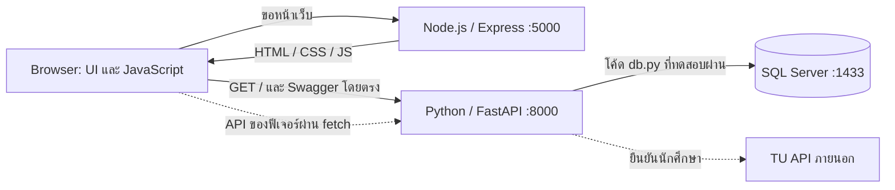
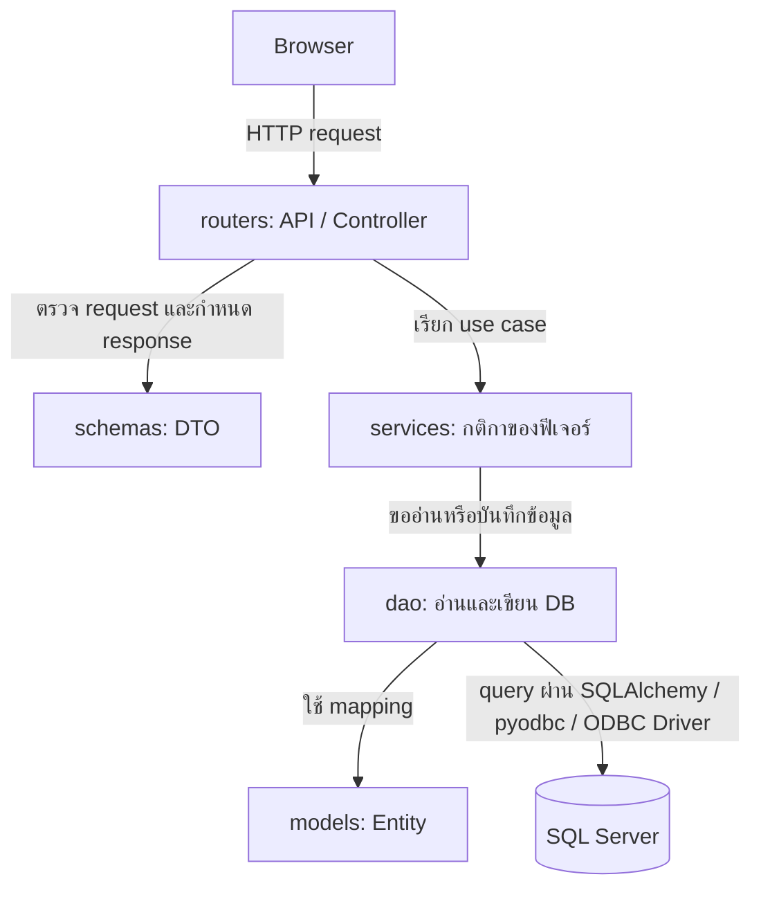
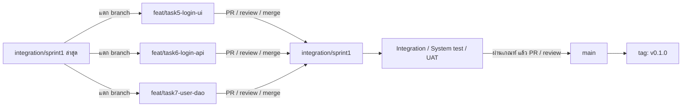

# CS261 Group 4

เว็บแบ่งปันแนวข้อสอบและสรุปรายวิชา CS สำหรับนักศึกษามหาวิทยาลัยธรรมศาสตร์

README นี้รวมวิธีติดตั้งและเริ่มระบบ โครงสร้างโปรเจกต์ การเทียบกับ Java รวมถึงวิธีทำงานร่วมกันด้วย Git และ Pull Request คำสั่งใช้ Windows PowerShell และรันจากโฟลเดอร์หลักที่มี `compose.yaml` เว้นแต่ระบุเป็นอย่างอื่น

## สารบัญ

- [ติดตั้งและเปิดระบบด้วย Docker](#docker-setup)
- [คำสั่งที่ใช้ระหว่างพัฒนา](#daily-development)
- [รัน frontend และ backend บน Windows](#windows-setup)
- [โครงสร้างและสถาปัตยกรรม](#architecture)
- [API, DTO, Service, Entity, DAO และ DB](#backend-layers)
- [Git ตั้งแต่รับ task จนเปิด Pull Request](#git-workflow)
- [ส่งเวอร์ชัน Demo และป้องกัน main](#release)
- [แก้ปัญหาระหว่างติดตั้งและพัฒนา](#troubleshooting)
- [เอกสารและแหล่งอ้างอิง](#references)


<a id="docker-setup"></a>

## ติดตั้งและเปิดระบบด้วย Docker

ใช้วิธีนี้เมื่อต้องการรันสภาพแวดล้อมเดียวกับทีม Docker จะจัดการ Node.js, Python, ODBC Driver และ SQL Server ภายใน containers ให้ เครื่องที่รันด้วย Docker อย่างเดียวจึงไม่ต้องติดตั้ง runtime เหล่านี้แยกบน Windows

### 1. ติดตั้งเครื่องมือ

| เครื่องมือ | วิธีเตรียม | ใช้ทำอะไร |
| --- | --- | --- |
| [Git for Windows](https://git-scm.com/downloads/win) | ติดตั้งและเปิด terminal ใหม่ | clone, branch, commit และ push |
| [VS Code](https://code.visualstudio.com/download) | ติดตั้งแล้วเปิดโฟลเดอร์ repo | แก้ไฟล์และใช้ Source Control |
| [Docker Desktop for Windows](https://docs.docker.com/desktop/setup/install/windows-install/) | ทำตามข้อกำหนด Windows/WSL 2 ในคู่มือ และใช้ Linux containers | รัน frontend, backend และ SQL Server |
| [SQL Server Management Studio](https://learn.microsoft.com/en-us/ssms/install/install) | ติดตั้งจากตัวติดตั้ง Microsoft | เชื่อมและตรวจ DB ผ่านหน้าจอ |

SSMS เป็นโปรแกรมจัดการฐานข้อมูล ส่วน SQL Server เป็นระบบฐานข้อมูลจริง วิธี Docker นี้ใช้ SQL Server ใน container สามารถใช้คำสั่งสร้าง DB แทน SSMS ได้ในขั้นตอนที่ 4

เปิด Docker Desktop แล้วรอให้ engine พร้อม เปิด PowerShell ใหม่และตรวจ:

```powershell
git --version
docker version
docker compose version
```

`docker version` ต้องติดต่อฝั่ง Server ได้ ถ้าแสดง error ให้เปิด Docker Desktop ก่อน SQL Server image ที่ใช้รองรับ Linux บน x86-64 ตาม [ข้อกำหนดของ Microsoft](https://learn.microsoft.com/en-us/sql/linux/quickstart-install-connect-docker?view=sql-server-ver17&tabs=cli)

### 2. ดาวน์โหลดโปรเจกต์

ก่อนให้สมาชิกเริ่มติดตั้ง ให้ผู้ประสานงานรวมและ push ไฟล์ setup เข้า `integration/sprint1` ให้ครบ สมาชิกแต่ละคนใช้บัญชี GitHub ของตนเองและมีสิทธิ์เข้าถึง repo จากนั้นรัน:

```powershell
git clone --branch integration/sprint1 https://github.com/Lilieay/CS261-Group4-Project.git
cd CS261-Group4-Project
```

ใน VS Code เลือก **File → Open Folder** แล้วเปิดโฟลเดอร์นี้ เปิด terminal ผ่าน **Terminal → New Terminal**

ถ้ามี repo อยู่แล้ว ดู [การนำ integration branch มาใช้](#git-start) ก่อน อย่า clone ซ้ำทับโฟลเดอร์เดิม

### 3. ตั้งรหัสผ่านเฉพาะเครื่อง

ครั้งแรก คัดลอก `.env.example` ที่โฟลเดอร์หลักเป็น `.env` ผ่าน VS Code หรือใช้:

```powershell
Copy-Item -LiteralPath .env.example -Destination .env
```

ถ้ามี `.env` อยู่แล้วให้เปิดแก้ไฟล์เดิม ข้ามคำสั่งคัดลอกเพื่อรักษาค่าที่ตั้งไว้

เปิด `.env` เปลี่ยนค่า `MSSQL_SA_PASSWORD` เป็นรหัสผ่านที่ตั้งเอง ตัวอย่างบรรทัดต่อไปนี้เป็นข้อความให้แทนที่:

```dotenv
MSSQL_SA_PASSWORD='YOUR_OWN_PASSWORD'
```

แทน `YOUR_OWN_PASSWORD` ด้วยค่าจริง แนะนำอย่างน้อย 12 ตัว โดยผสมอังกฤษตัวใหญ่ ตัวเล็ก ตัวเลข และสัญลักษณ์อย่าง `!` หรือ `_` SQL Server ต้องการอย่างน้อย 8 ตัวและอย่างน้อย 3 ประเภทจาก 4 ประเภทนี้ตาม [นโยบายรหัสผ่านของ SQL Server](https://learn.microsoft.com/en-us/sql/linux/containers/configure?view=sql-server-ver17#persist-your-data)

เก็บค่าจริงใน `.env` ของแต่ละเครื่องและไม่ส่งรหัสผ่านใน PR หรือผลทดสอบ ไฟล์นี้ถูก ignore ส่วน `.env.example` เป็นแม่แบบที่ commit ได้

ตรวจว่า Git ละเว้นไฟล์จริง:

```powershell
git check-ignore .env
docker compose config --quiet
```

คำสั่งแรกควรแสดง `.env` คำสั่งที่สองไม่แสดงข้อความเมื่อ config ถูกต้อง ใช้ `--quiet` เมื่อตรวจ Compose เพราะ `docker compose config` แบบแสดงเนื้อหาจะมีค่ารหัสผ่านที่แทนแล้ว

### 4. เปิด SQL Server และสร้างฐานข้อมูลครั้งแรก

รันเฉพาะฐานข้อมูลก่อน:

```powershell
docker compose up -d sqlserver
docker compose ps
```

รอให้ `sqlserver` ขึ้น `Up ... (healthy)` ดูผ่าน Docker Desktop → **Containers → cs261-group4** ได้เช่นกัน

Compose เปิด SQL Server แต่ยังไม่รัน `db/init.sql` อัตโนมัติ จึงต้องสร้าง `CS261Group4Dev` ครั้งแรก เลือกวิธีใดวิธีหนึ่งต่อไปนี้

#### สร้างผ่าน SSMS

เปิด SSMS → **Connect → Database Engine** แล้วกรอก:

| ช่อง | ค่า |
| --- | --- |
| Server name | `127.0.0.1,1433` |
| Authentication | `SQL Server Authentication` |
| Login / User name | `sa` |
| Password | ค่าใน `.env` โดยไม่รวมเครื่องหมาย quote ที่ครอบค่า |
| Encryption | `Mandatory` |
| Trust server certificate | เลือกสำหรับ SQL Server พัฒนาในเครื่องนี้ |

กด **Connect** เลือก server นี้ใน Object Explorer แล้วเปิด **New Query** คัดลอกเนื้อหา `db/init.sql` มาวางและกด **Execute** หรือเปิดไฟล์ด้วย **File → Open → File** แล้วเลือก connection ของ Docker ให้ถูกต้อง

ผลลัพธ์ต้องมีชื่อ `CS261Group4Dev` จากนั้นคลิกขวา **Databases → Refresh** เพื่อดูฐานข้อมูล สคริปต์ตรวจว่ามีฐานข้อมูลก่อนสร้าง จึงรันซ้ำได้

อีกวิธีคือคลิกขวา **Databases → New Database…** ใส่ชื่อ `CS261Group4Dev` แล้วกด **OK** การใช้ไฟล์ SQL ช่วยให้ทุกคนอ้างอิงขั้นตอนเดียวกัน รายละเอียดหน้าต่าง connection อยู่ใน [คู่มือ SSMS](https://learn.microsoft.com/en-us/ssms/quickstarts/ssms-connect-query-sql-server)

#### สร้างผ่าน PowerShell โดยไม่ติดตั้ง SSMS

รันจากโฟลเดอร์หลัก:

```powershell
Get-Content -Raw -Encoding UTF8 -LiteralPath db/init.sql |
    docker compose exec -T sqlserver sh -c 'export SQLCMDPASSWORD=$MSSQL_SA_PASSWORD; exec /opt/mssql-tools18/bin/sqlcmd -S localhost -U sa -C -b'
```

คำสั่งส่งสคริปต์เข้า `sqlcmd` ใน SQL Server container และอ่านรหัสผ่านจาก environment ภายใน container ผลต้องแสดง `CS261Group4Dev` เช่นเดียวกับ SSMS

`db/init.sql` สร้างเฉพาะฐานข้อมูลเปล่า ตาราง User, Course และตารางของฟีเจอร์เป็นงาน Entity/DAO ที่ทีมต้องทำต่อ

### 5. เปิดระบบครบสามส่วน

ถ้าเคยเปิด server บน Windows หรือเปิด container แบบ `docker run` ให้หยุดตัวที่ใช้พอร์ต 5000 และ 8000 ก่อน เช่นกด **Stop** ที่ `cs261-group4-frontend` และ `cs261-group4-backend` ตัวเดิมใน Docker Desktop

จากนั้นรัน:

```powershell
docker compose up -d --build
docker compose ps
```

ควรเห็น `frontend`, `backend` และ `sqlserver` เป็น `Up` โดย SQL Server เป็น `healthy` ชื่อ container โดยปกติคือ `cs261-group4-frontend-1`, `cs261-group4-backend-1` และ `cs261-group4-sqlserver-1`

`-d` เปิดระบบเบื้องหลัง จึงกลับมาพิมพ์คำสั่งได้ ส่วน `--build` build images จาก Dockerfiles ก่อนเริ่มระบบ backend รอ SQL Server ผ่าน healthcheck แต่ healthcheck นี้ยังไม่ได้ตรวจตารางของฟีเจอร์

### 6. ตรวจหน้าเว็บ API และการเชื่อม DB

| สิ่งที่เปิด | ผลที่คาดหวัง |
| --- | --- |
| [Frontend](http://127.0.0.1:5000/) | เห็นหน้าทดสอบ กดปุ่มแล้วข้อความเปลี่ยนเป็น `javascript active` |
| [Backend](http://127.0.0.1:8000/) | JSON `{"message":"Backend is running"}` |
| [Swagger UI](http://127.0.0.1:8000/docs) | เห็น `GET /` กด **Try it out → Execute** แล้วได้ HTTP 200 |
| SSMS → `127.0.0.1,1433` | เห็นฐานข้อมูล `CS261Group4Dev` |

การเปิด Swagger ตรวจ API ได้ ส่วน SSMS ตรวจ DB ได้ หากต้องยืนยันว่าโค้ด backend เชื่อม DB จริง ให้คัดลอกทั้ง block นี้ไปรันใน PowerShell:

```powershell
@'
from sqlalchemy import text
from app.db import engine

with engine.connect() as connection:
    print("Connection test:", connection.execute(text("SELECT 1")).scalar_one())
    print("Database:", connection.execute(text("SELECT DB_NAME()")).scalar_one())
'@ | docker compose exec -T backend python -
```

ผลที่คาดหวัง:

```text
Connection test: 1
Database: CS261Group4Dev
```

`SELECT 1` ตรวจว่าคุยกับ DB ได้ ส่วน `SELECT DB_NAME()` ตรวจว่าต่อฐานข้อมูลที่ต้องการ การมีสถานะ `Up` หรือเปิด `GET /` ได้อย่างเดียวไม่ครอบคลุมการตรวจนี้

### 7. ปิด เปิด และตรวจข้อมูลถาวร

หยุดระบบโดยเก็บ containers ไว้:

```powershell
docker compose stop
```

เปิดกลับ:

```powershell
docker compose start
```

หากต้องการลบ containers และเครือข่ายแล้วสร้างใหม่ โดยเก็บ named volume ไว้ ให้ใช้ทีละคำสั่ง:

```powershell
docker compose down
docker compose up -d
```

รอ SQL Server เป็น `healthy` แล้ว Refresh ฐานข้อมูลใน SSMS และตรวจการเชื่อม backend ตามขั้นตอนที่ 6 ควรยังเห็น `CS261Group4Dev` โดยไม่ต้องรัน init ใหม่

ห้ามเพิ่ม `-v` เมื่อต้องการเก็บข้อมูล เพราะ `docker compose down -v` ลบ named volume ด้วยตาม [เอกสาร Docker](https://docs.docker.com/reference/cli/docker/compose/down/) Volume ของโปรเจกต์นี้ชื่อ `cs261-group4_sqlserver_data` และเก็บข้อมูลที่ `/var/opt/mssql` ภายใน SQL Server container แต่ละเครื่องมี volume และข้อมูลของตัวเอง Git ไม่ส่งข้อมูลใน volume ให้เพื่อน

<a id="daily-development"></a>

## คำสั่งที่ใช้ระหว่างพัฒนา

Compose ปัจจุบันใช้โค้ดที่คัดลอกเข้า image ตอน build ยังไม่มี bind mount หรือ hot reload เมื่อแก้ไฟล์ในเครื่องต้อง build ส่วนที่เปลี่ยนใหม่ แล้ว refresh browser

| งาน | คำสั่งที่โฟลเดอร์หลัก |
| --- | --- |
| เปิดครบสามส่วน | `docker compose up -d` |
| แก้ HTML/CSS/JS หรือ Express | `docker compose up -d --build frontend` |
| แก้ Python หรือ requirements | `docker compose up -d --build backend` |
| เปลี่ยนทั้งสองฝั่ง | `docker compose up -d --build` |
| ดูสถานะ | `docker compose ps -a` |
| ดู log ของ backend | `docker compose logs --tail 100 backend` |
| ดู log ของ SQL Server | `docker compose logs --tail 100 sqlserver` |
| ดู log ต่อเนื่อง | `docker compose logs -f backend` |
| ตรวจ packages ใน backend container | `docker compose exec -T backend python -m pip check` |

`Ctrl+C` ขณะดู log แบบ `-f` หยุดการดู log ระบบที่เปิดด้วย `-d` ยังรันอยู่ เมื่อแก้ dependencies ของ frontend ให้ commit ทั้ง `package.json` และ `package-lock.json`

Frontend ใช้ `npm ci` ตาม lockfile ส่วน `backend/requirements.txt` ยังไม่ล็อกเวอร์ชัน และ tags ของ base images ยังเปลี่ยนตาม upstream ได้ จึงยังไม่ใช่การ build ที่ตรึงทุก dependency ทีมควรตกลงการล็อกเวอร์ชันก่อนรอบส่งมอบที่ต้องทำซ้ำตรงกัน

<a id="windows-setup"></a>

## รัน frontend และ backend บน Windows

ใช้วิธีนี้เมื่ออยากแก้โค้ดแล้วทดสอบบน Windows โดยตรง เลือกรันแต่ละ server ด้วยวิธีเดียวในเวลาเดียวกัน เพื่อไม่ให้ชนพอร์ตกับ container

### 1. ติดตั้ง runtime และฐานข้อมูล

นอกจาก Git และ VS Code ให้ติดตั้ง:

| เครื่องมือ | ใช้ทำอะไร |
| --- | --- |
| [Node.js](https://nodejs.org/en/download) รุ่น 24.x พร้อม npm | รัน Express และติดตั้ง dependencies |
| [Python](https://www.python.org/downloads/) รุ่น 3.14.x | รัน FastAPI และสร้าง venv |
| [ODBC Driver 18 for SQL Server](https://learn.microsoft.com/en-us/sql/connect/odbc/download-odbc-driver-for-sql-server?view=sql-server-ver17) รุ่น x64 | ให้ pyodbc บน Windows ติดต่อ SQL Server |
| [SQL Server Express](https://www.microsoft.com/en-us/sql-server/sql-server-downloads) รุ่น 2022 ตามฐานที่ทีมใช้ | ฐานข้อมูลพัฒนาใน Windows |
| [SSMS](https://learn.microsoft.com/en-us/ssms/install/install) | สร้างและตรวจ DB ผ่านหน้าจอ |

ในตัวติดตั้ง SQL Server Express เลือกการติดตั้ง instance `SQLEXPRESS` และ Windows Authentication ให้บัญชี Windows ที่ใช้พัฒนามีสิทธิ์จัดการฐานข้อมูล เปิด terminal ใหม่และตรวจ:

```powershell
node --version
npm --version
python --version
```

เวอร์ชันที่ตรวจบนเครื่องผู้พัฒนาคือ Node.js `24.18.0`, Python `3.14.6` และ Git `2.51.0` ใช้เป็นข้อมูลของเครื่องที่ทดสอบ ไม่ได้บังคับให้ดาวน์โหลด patch เดียวกัน

### 2. ติดตั้ง frontend

หลัง clone และเข้าโฟลเดอร์หลัก:

```powershell
npm --prefix frontend ci
```

ถ้าเพิ่ม package ใหม่ ใช้ `npm --prefix frontend install <package-name>` โดยแทนชื่อ package จริง แล้ว commit ทั้ง manifest และ lockfile

### 3. สร้างและ activate venv ของ backend

`venv` เป็น environment ที่แยก packages ของ Python สำหรับโปรเจกต์ โมดูลนี้มากับ Python สมาชิกแต่ละคนสร้างของตนเอง ไม่คัดลอก `.venv` จากเครื่องเพื่อนและไม่ commit เข้า Git ตาม [คู่มือ Python venv](https://docs.python.org/3.14/library/venv.html)

ครั้งแรกให้สร้าง:

```powershell
python -m venv backend/.venv
```

ถ้ามี environment นี้แล้วให้ข้ามการสร้าง จากนั้น activate ก่อนติดตั้งและรัน backend:

```powershell
.\backend\.venv\Scripts\Activate.ps1
python -m pip install -r backend/requirements.txt
python -m pip check
```

ปกติจะเห็น `(.venv)` หน้าบรรทัดคำสั่ง ตรวจ Python ที่ใช้อยู่ได้ด้วย:

```powershell
python -c "import sys; print(sys.executable)"
```

path ต้องลงท้ายด้วย `backend\.venv\Scripts\python.exe` การ activate มีผลเฉพาะ terminal นี้ เปิด terminal ใหม่ต้อง activate อีกครั้ง แต่ไม่ต้องสร้าง venv ใหม่ หาก requirements เปลี่ยน ให้ติดตั้งตามไฟล์อีกครั้ง

หากใช้ Command Prompt ให้ activate ด้วย:

```bat
backend\.venv\Scripts\activate.bat
```

ถ้า PowerShell บล็อก script ดู [วิธีแก้ปัญหา](#troubleshooting) หลังหยุด backend ใช้ `deactivate` เพื่อออกจาก environment ได้

### 4. สร้าง DB และตั้ง backend/.env

เปิด SSMS และเชื่อม server ตาม instance จริง ตัวอย่างเครื่องพัฒนาใช้:

| ช่อง | ค่า |
| --- | --- |
| Server name | `.\SQLEXPRESS` |
| Authentication | `Windows Authentication` |
| Encryption | `Mandatory` |
| Trust server certificate | เลือกสำหรับ server พัฒนาในเครื่อง |

รัน `db/init.sql` บน connection นี้ หรือใช้ **Databases → New Database…** สร้าง `CS261Group4Dev`

คัดลอก `backend/.env.example` เป็น `backend/.env` ครั้งแรก หากมีไฟล์จริงแล้วให้แก้ไฟล์เดิม:

```powershell
Copy-Item -LiteralPath backend/.env.example -Destination backend/.env
```

ตั้งค่าให้ตรงกับ instance ในเครื่อง โดยเก็บ connection string เป็นบรรทัดเดียว:

```dotenv
DB_CONNECTION_STRING=DRIVER={ODBC Driver 18 for SQL Server};SERVER=.\SQLEXPRESS;DATABASE=CS261Group4Dev;Trusted_Connection=yes;Encrypt=yes;TrustServerCertificate=yes
```

`Trusted_Connection=yes` ใช้สิทธิ์บัญชี Windows ที่รัน Python ฐานข้อมูลนี้เป็นอีก instance จาก SQL Server ใน Docker แม้ใช้ชื่อ `CS261Group4Dev` เหมือนกัน การเปลี่ยนวิธีรันไม่ย้ายข้อมูลระหว่างสอง instance ให้อัตโนมัติ

### 5. เปิด frontend และ backend

เปิด terminal สองหน้าต่างที่โฟลเดอร์หลัก ถ้า containers ของ frontend/backend ยังรันอยู่ ให้หยุดก่อน:

```powershell
docker compose stop frontend backend
```

ถ้าไม่ได้ใช้ Docker ให้ข้ามคำสั่งนี้

Terminal ของ frontend:

```powershell
npm --prefix frontend start
```

Terminal ของ backend ให้ activate แล้วรัน:

```powershell
.\backend\.venv\Scripts\Activate.ps1
python -m uvicorn app.main:app --app-dir backend --host 127.0.0.1 --port 8000 --reload
```

คำสั่ง server ทั้งสองรันค้างเพื่อรับ request ต่างจาก Docker แบบ `-d` ใช้ `Ctrl+C` หยุด ตรวจหน้าเว็บและ Swagger ตาม [ขั้นตอนตรวจ setup](#docker-setup)

เมื่อแก้ไฟล์ใน `frontend/public` ให้บันทึกแล้ว refresh browser เมื่อแก้ Express server ให้หยุดและเริ่ม frontend ใหม่ ส่วน Uvicorn ใช้ `--reload` เพื่อโหลด Python ใหม่ระหว่างพัฒนา

### 6. ตรวจ DB ผ่านโค้ดบน Windows

เปิด PowerShell ที่โฟลเดอร์หลักและ activate venv แล้วรันทั้ง block:

```powershell
@'
from sqlalchemy import text
from backend.app.db import engine

with engine.connect() as connection:
    print("Connection test:", connection.execute(text("SELECT 1")).scalar_one())
    print("Database:", connection.execute(text("SELECT DB_NAME()")).scalar_one())
'@ | python -
```

ผลต้องเป็น `Connection test: 1` และ `Database: CS261Group4Dev` เหมือนการตรวจผ่าน Docker แต่ connection นี้ใช้ config ของ Windows

<a id="architecture"></a>

## โครงสร้างและสถาปัตยกรรม

### ไฟล์และโฟลเดอร์หลัก

ต้นไม้เลือกส่วนหลักที่มีอยู่จริง ไม่แสดง dependencies, cache และไฟล์ placeholder ทุกไฟล์ ใช้ `git ls-files --cached --others --exclude-standard` ตรวจรายการไฟล์ที่ Git มองเห็นได้

```text
CS261-Group4-Project/
├── README.md
├── compose.yaml                 จัดการสาม services และ volume ของ DB
├── .env.example                 แม่แบบรหัสผ่านสำหรับ Docker
├── .env                         ค่าจริงของเครื่อง ไม่เก็บเข้า Git
├── .gitignore
├── frontend/
│   ├── Dockerfile
│   ├── .dockerignore
│   ├── package.json
│   ├── package-lock.json
│   ├── src/
│   │   ├── server.js            Express ส่งไฟล์จาก public
│   │   ├── routes/              เส้นทางและ request handlers ของ Express
│   │   ├── services/            งานที่ Node ทำหรือประสานให้ routes ใช้
│   │   ├── config/              ค่าตั้งต้นของ Node เช่น host, port และ backend URL
│   │   └── utils/               ฟังก์ชันช่วยทั่วไปที่ใช้ซ้ำ
│   └── public/
│       ├── index.html           หน้าทดสอบที่เปิดผ่าน /
│       ├── css/styles.css       CSS ของหน้าทดสอบ
│       ├── js/script.js         JavaScript ของปุ่มทดสอบ
│       ├── pages/               เตรียมไว้สำหรับหน้าอื่น
│       └── assets/              รูป ไอคอน และฟอนต์
├── backend/
│   ├── Dockerfile
│   ├── .dockerignore
│   ├── requirements.txt
│   ├── .env.example             แม่แบบเชื่อม SQL Express บน Windows
│   ├── .env                     ค่าจริงของเครื่อง ไม่เก็บเข้า Git
│   ├── .venv/                   สร้างเองเมื่อรันบน Windows ไม่เก็บเข้า Git
│   ├── app/
│   │   ├── main.py              สร้าง FastAPI app และ GET /
│   │   ├── config.py            อ่าน environment และ backend/.env
│   │   ├── db.py                สร้าง SQLAlchemy engine
│   │   ├── routers/             API endpoints ของฟีเจอร์
│   │   ├── schemas/             Request/response DTO
│   │   ├── services/            กติกาและขั้นตอนของฟีเจอร์
│   │   ├── models/              Entity ที่ map กับตาราง DB
│   │   └── dao/                 อ่านและเขียนข้อมูล
│   └── test/test.py             ตอนนี้ยังว่าง
├── db/
│   └── init.sql                 สร้างฐานข้อมูลครั้งแรก รันเองตามคู่มือ
└── docs/                        PDF ข้อกำหนดและ Workshop
```

โฟลเดอร์ feature ใน backend และบางโฟลเดอร์ใน frontend ยังมี placeholder ชื่อโฟลเดอร์ช่วยจัดตำแหน่งงาน แต่ต้องเขียนและเชื่อมโค้ดจึงเกิดพฤติกรรมจริง

### ภาพรวมระบบ

Diagram ใช้ Mermaid เปิดดูบน GitHub หรือ Markdown viewer ที่รองรับได้ เส้นทึบคือส่วนที่ตรวจทำงานแล้ว เส้นประคือการเชื่อมของฟีเจอร์ที่ต้องเพิ่ม



การเชื่อม DB ในภาพหมายถึงเรียกใช้ `app.db.engine` ได้แล้ว endpoint `GET /` ยังไม่ได้เรียก engine ปัจจุบัน `public/js/script.js` เปลี่ยนข้อความบนหน้าเว็บและยังไม่มี `fetch` ไป backend

Node.js เป็น runtime สำหรับ JavaScript บน server ส่วน Express จัดการ HTTP และส่งไฟล์หน้าเว็บ JavaScript ใน `frontend/src` รันบน Node.js ส่วน `frontend/public/js` รันใน browser งาน API ของระบบนี้อยู่ฝั่ง FastAPI

### ไฟล์ที่ต้องแก้ตามงาน frontend

| งาน | ตำแหน่ง | ตัวอย่าง |
| --- | --- | --- |
| สร้างเนื้อหาและฟอร์ม | HTML ใน `public` หรือ `public/pages` | ช่องกรอกและปุ่ม Login |
| จัดหน้าตา | `public/css` | Layout สี และข้อความ error |
| ทำให้หน้าโต้ตอบ | `public/js` | รับ submit, ตรวจช่องว่าง, เรียก API และแสดง response |
| เพิ่มรูปหรือไอคอน | `public/assets` | Assets ที่หน้าเว็บใช้ |
| ปรับการเสิร์ฟไฟล์ | `src/server.js` | ตั้ง Express หรือเพิ่ม route สำหรับส่งหน้าเว็บ |

การตรวจช่องกรอกใน frontend ช่วยให้ผู้ใช้แก้ข้อมูลก่อนส่ง ส่วน backend ยังต้องตรวจข้อมูลและสิทธิ์ เพราะผู้ใช้ส่ง request โดยไม่ผ่านหน้าเว็บได้

### หน้าที่ของโฟลเดอร์ใน frontend/src

โค้ดใน `frontend/src` รันบน Node.js มีหน้าที่จัดการ web server ที่ส่งหน้าเว็บให้ผู้ใช้ ส่วนโค้ดที่จับปุ่ม เปลี่ยน DOM หรือเรียก API จาก browser อยู่ใน `frontend/public/js`

| ไฟล์หรือโฟลเดอร์ | หน้าที่ | ตัวอย่างการใช้งาน |
| --- | --- | --- |
| `server.js` | จุดเริ่มต้นของ Express สร้าง app ตั้ง middleware ลงทะเบียน routes และเปิดพอร์ต | ปัจจุบันตั้ง `express.static` ให้ส่งไฟล์จาก `public` และเปิดพอร์ต 5000 |
| `routes/` | แยกโค้ดที่จับคู่ HTTP method และ URL ของ Express กับสิ่งที่จะตอบกลับ | กำหนด `GET /courses` ให้ส่งไฟล์หน้ารายวิชา แทนการใส่ทุก route ใน `server.js` |
| `services/` | แยกงานที่ Node ต้องทำหรือประสานให้ route เรียกใช้ โดยไม่ผูกทุกขั้นตอนไว้กับ request handler | หากออกแบบให้ Express เรียก FastAPI แทน browser ให้วางโค้ดเรียก API และจัดการผลตอบไว้ที่นี่ |
| `config/` | รวมค่าตั้งต้นที่ Node ใช้ เช่น host, port และ URL ของ backend โดยอ่านจาก environment ตามที่ทีมกำหนด | โมดูล config ส่งค่า `HOST` และ `PORT` ให้ `server.js` หรือส่ง backend URL ให้ service |
| `utils/` | เก็บฟังก์ชันช่วยขนาดเล็กที่หลายไฟล์ใช้ซ้ำ และไม่มีขั้นตอนของฟีเจอร์อยู่ในตัว | ฟังก์ชันหาตำแหน่งไฟล์ HTML ที่ routes ต้องส่ง หรือประกอบ query string สำหรับเรียก API |

โฟลเดอร์เหล่านี้เป็นการแบ่งความรับผิดชอบที่ทีมเลือกไว้ ไม่ใช่ชื่อพิเศษที่ Express โหลดให้อัตโนมัติ ปัจจุบันโฟลเดอร์ทั้งสี่ยังมีไฟล์ placeholder และ `server.js` ยังไม่ได้เรียกโค้ดจากโฟลเดอร์เหล่านี้

#### routes ใช้อย่างไร

เมื่อจำเป็นต้องกำหนด URL ของหน้าเว็บเอง ให้สร้างโมดูลใน `routes` ด้วย `express.Router()` กำหนด handler ของแต่ละ URL แล้ว export router จากนั้น import และลงทะเบียนด้วย `app.use(...)` ใน `server.js` ตาม [คู่มือ Express routing](https://expressjs.com/en/guide/routing/)

ตัวอย่างเช่น หน้าอยู่ใน `public/pages/courses.html` แต่ต้องการให้ผู้ใช้เปิดด้วย `/courses` ก็เขียน route ส่งไฟล์หน้านั้นได้ ชื่อไฟล์และ URL นี้เป็นตัวอย่าง ยังไม่ได้มีใน repo หากเปิดด้วย path ของไฟล์ เช่น `/pages/courses.html` อยู่แล้ว `express.static` ส่งไฟล์ให้ได้โดยไม่ต้องสร้าง route เพิ่ม ตาม [คู่มือ static files](https://expressjs.com/en/starter/static-files/)

#### services ใช้เมื่อ Node มีงานที่ต้องทำเพิ่มเติม

ในระบบที่ browser เรียก FastAPI โดยตรง โค้ด `fetch` ของหน้าจออยู่ใน `public/js` หากทีมเลือกให้ Express เป็นตัวกลางเรียก backend จึงค่อยเพิ่ม service ฝั่ง Node เช่น `services/backendClient.js` เพื่อจัดการการเรียก HTTP ให้ routes ใช้ร่วมกัน ชื่อไฟล์นี้เป็นตัวอย่าง

`frontend/src/services` กับ `backend/app/services` รันคนละส่วน ฝั่ง Node รับผิดชอบงานของ web server ตามแบบที่เลือก ส่วนกติกาของระบบ การยืนยันตัวตนและการประสาน DAO อยู่ใน FastAPI ไม่ต้องเขียนกติกาชุดเดียวกันซ้ำทั้งสองฝั่ง

#### config และ utils ช่วยให้โค้ดใช้ค่าหรือฟังก์ชันเดียวกัน

`config` รวมค่าที่ใช้ตั้งระบบ เช่น `HOST`, `PORT` และ backend URL ค่าจริงของเครื่องอ่านจาก environment ส่วนค่าเริ่มต้นที่ไม่มีข้อมูลลับเขียนไว้ในโมดูลได้ ปัจจุบัน `server.js` อ่าน `process.env.HOST` โดยตรงและใช้พอร์ต 5000 ที่กำหนดไว้ในไฟล์ ยังไม่มีโมดูล config แยก

`utils` ใช้กับฟังก์ชันช่วยทั่วไปที่หลายไฟล์ต้องใช้ เช่นจัดการ path ของไฟล์ หลีกเลี่ยงการนำกติกาของฟีเจอร์หรือการเรียก DB มารวมไว้ในโฟลเดอร์นี้ ทุกโมดูลต้องถูก import จากไฟล์ที่ใช้จึงทำงาน

สำหรับโปรเจกต์ตอนนี้ Express ส่ง static files เป็นหลัก ให้เพิ่มโค้ดในแต่ละโฟลเดอร์เมื่อ task ต้องใช้หน้าที่นั้น JavaScript ใน `src` ไม่ได้ถูกส่งให้ browser อัตโนมัติ และ repo ยังไม่มีระบบ bundle ที่แปลงไฟล์เหล่านี้เป็น browser JavaScript

เมื่อ browser เรียก FastAPI ที่พอร์ต 8000 จากหน้าเว็บพอร์ต 5000 ทั้งสองเป็นคนละ origin ต้องตกลง CORS หรือ proxy ในงานเชื่อม API ตาม [คู่มือ FastAPI CORS](https://fastapi.tiangolo.com/tutorial/cors/)

### Docker, environment และการเชื่อม DB

| สิ่ง | หน้าที่ในโปรเจกต์ |
| --- | --- |
| Image | ชุด runtime, dependencies และโค้ดที่ build จาก Dockerfile |
| Container | instance ของ image ที่กำลังรัน |
| Compose service | ชื่อส่วนที่จัดการ เช่น `frontend`, `backend`, `sqlserver` |
| Named volume | ที่เก็บข้อมูล SQL Server แยกจากอายุ container |
| `.dockerignore` | กัน cache, dependencies ในเครื่อง และไฟล์ environment ไม่ให้เข้าบริบท build |
| `.gitignore` | กัน `.env`, `.venv`, `node_modules` และ cache ไม่ให้เป็นไฟล์ใหม่ใน Git |

Dockerfile ของ frontend ตั้ง `HOST=0.0.0.0` ให้ Express รับ connection จากภายนอก container ส่วน backend ใช้ Uvicorn `--host 0.0.0.0` Compose เปิดพอร์ตที่ `127.0.0.1` ของเครื่องพัฒนา

ตำแหน่งที่ผู้เรียกอยู่เป็นตัวกำหนด host ที่ต้องใช้:

| ผู้เรียก | ปลายทาง |
| --- | --- |
| Browser บนเครื่องผู้พัฒนา → frontend | `http://127.0.0.1:5000` |
| Browser หรือ Postman บนเครื่องผู้พัฒนา → backend | `http://127.0.0.1:8000` |
| SSMS บนเครื่องผู้พัฒนา → SQL Server ใน Docker | `127.0.0.1,1433` |
| Backend container → SQL Server container | `sqlserver,1433` |
| Backend บน Windows → SQL Express ใน Windows | `.\SQLEXPRESS` ตาม instance จริง |

Compose สร้างเครือข่ายให้ services ติดต่อกันด้วยชื่อ service ตาม [เอกสาร Docker networking](https://docs.docker.com/compose/how-tos/networking/) `localhost` ใน backend container หมายถึง backend container เอง ส่วน browser ไม่ได้ใช้ชื่อ `sqlserver` หรือ `backend` ของเครือข่าย Docker

ไฟล์ environment สองตำแหน่งมีหน้าที่ดังนี้:

| ไฟล์หรือค่า | ใช้เมื่อ |
| --- | --- |
| `.env` ที่โฟลเดอร์หลัก | Compose อ่าน `MSSQL_SA_PASSWORD` แล้วส่งค่าให้ SQL Server และส่งเป็น `DB_PASSWORD` ให้ backend |
| `backend/.env` | Python บน Windows อ่าน `DB_CONNECTION_STRING` สำหรับ SQL Express |
| `DB_CONNECTION_STRING` ใน Compose | ระบุ driver, `sqlserver,1433`, DB, user `sa` และค่าการเข้ารหัส โดยไม่มีรหัสผ่านจริงใน YAML |

`config.py` โหลด `backend/.env` โดยอิงตำแหน่งไฟล์ และ environment ที่มีอยู่ก่อนมีลำดับก่อนค่าในไฟล์ ถ้ามี `DB_PASSWORD` จะเพิ่มรหัสผ่านเข้า connection string พร้อม escape เครื่องหมายปิด brace จากนั้น `db.py` สร้าง SQLAlchemy engine จาก `mssql+pyodbc` การเชื่อมจริงเริ่มเมื่อเรียก connection ไม่ใช่เพียง import engine

ODBC เป็นมาตรฐานการเชื่อมฐานข้อมูล ในชุดนี้ SQLAlchemy ใช้ pyodbc แล้ว pyodbc ใช้ Microsoft ODBC Driver 18 เพื่อคุยกับ SQL Server Dockerfile ติดตั้ง driver ใน backend image แล้ว หากรัน Python บน Windows ต้องมี driver บน Windows ด้วย

โฟลเดอร์ `db/` เก็บสคริปต์ที่แชร์ผ่าน Git ส่วน rows และไฟล์ฐานข้อมูลจริงอยู่ใน SQL Server/volume การย้ายจาก Windows ไป Docker เปลี่ยน config ของ connection ได้โดยใช้โค้ดเข้าถึง DB ชุดเดิม แต่ต้องสร้าง DB/schema และย้ายข้อมูลแยกหากมีข้อมูลเดิม

### เทียบ backend กับ Java/Spring Boot

ตารางเทียบหน้าที่ ชื่อไฟล์ฟีเจอร์เป็นแนวทางที่ยังต้องพัฒนา:

| หน้าที่ | Java/Spring Boot | Python/FastAPI ของโปรเจกต์ |
| --- | --- | --- |
| ประกอบแอป | คลาส `@SpringBootApplication` | `app/main.py` สร้าง `FastAPI()` และจะ include routers |
| รับ HTTP request | `@RestController`, `@GetMapping`, `@PostMapping` | `routers/` ใช้ `APIRouter` และ decorators |
| ข้อมูลเข้าและออก | DTO เช่น `LoginRequest`, `LoginResponse` | Pydantic models ใน `schemas/` |
| กติกาของฟีเจอร์ | Service ที่มักใช้ `@Service` | ฟังก์ชันหรือคลาสใน `services/` |
| อ่านและเขียน DB | DAO หรือ Repository | ฟังก์ชันหรือคลาสใน `dao/` |
| แบบข้อมูลถาวร | JPA Entity ที่ใช้ `@Entity` | SQLAlchemy mapped model ใน `models/` |
| ORM | JPA และ implementation เช่น Hibernate | SQLAlchemy ORM ที่ทีมจะเพิ่ม |
| ค่าตั้งต้น | `application.properties`, `application.yml` | Environment, `config.py` และ `db.py` |
| Dependencies | Maven/Gradle | pip และ `requirements.txt` |
| ระบบฐานข้อมูล | SQL Server หรือฐานที่กำหนด | SQL Server |

FastAPI เป็น framework ส่วน Uvicorn เป็น server ที่รันแอป กลไกต่างจาก Spring เช่นการจัดการ dependencies และ object จึงเทียบตามความรับผิดชอบ Spring Data JPA สร้าง repository implementation บางรูปแบบให้ได้ ส่วนการสร้างโฟลเดอร์ `dao` ใน Python ไม่ได้สร้างเมธอดอ่านหรือบันทึกข้อมูลให้อัตโนมัติ

<a id="backend-layers"></a>

## API, DTO, Service, Entity, DAO และ DB

คำเหล่านี้เป็นหน้าที่ของโค้ด หลายส่วนอยู่ใน backend container เดียวกัน ไม่ได้ต้องสร้าง container ต่อชั้น

| ส่วน | ตอบคำถามอะไร | ตัวอย่างงาน Login | ตำแหน่ง |
| --- | --- | --- | --- |
| API / Router | เรียกด้วย method/path อะไร และตอบอย่างไร | รับ request Login แล้วตอบ HTTP status และข้อมูล | `routers/` |
| DTO | ส่ง fields อะไรได้ และชนิดข้อมูลเป็นอะไร | `LoginRequest`, `LoginResponse` | `schemas/` |
| Service | use case ต้องทำอะไรและลำดับใด | ยืนยัน TU, ตรวจนักศึกษา แล้วหาหรือสร้างผู้ใช้ | `services/` |
| Entity | ข้อมูลถาวรมีรูปแบบใดและ map กับตารางอย่างไร | `User` และ fields ที่ทีมออกแบบ | `models/` |
| DAO | อ่านหรือเขียนข้อมูลอย่างไร | ค้นหา User จากตัวตน TU และบันทึก User ใหม่ | `dao/` |
| DB | rows จริงถูกเก็บที่ไหน | ตารางผู้ใช้และข้อจำกัดความไม่ซ้ำ | SQL Server |

### API และ DTO

API ย่อจาก Application Programming Interface ในโปรเจกต์นี้ใช้ HTTP API ระหว่าง browser กับ FastAPI Endpoint ระบุ method และ path รวมถึง request/response ที่ตกลงกัน ตอนนี้มีเพียง `GET /` สำหรับตรวจ server

DTO ย่อจาก Data Transfer Object เป็นแบบข้อมูลที่ส่งข้าม API วางแผนใช้ Pydantic `BaseModel` ใน `schemas` สำหรับตรวจ request และกำหนด response ตัวอย่างต่อไปนี้เป็นแนวทางอธิบาย ยังไม่ใช่ spec ที่ทีมอนุมัติ:

```text
POST /api/auth/login
```

```json
{
    "username": "example-student",
    "password": "example-only"
}
```

Response ตัวอย่างเฉพาะข้อมูลผู้ใช้:

```json
{
    "user": {
        "id": 12,
        "display_name": "Example Student"
    }
}
```

JSON เป็นรูปแบบข้อมูล ส่วน DTO เป็นแบบที่ใช้กำหนดและตรวจข้อมูลนั้น ต้องตกลง fields จริง, error responses และวิธีรักษาสถานะ Login ก่อนเขียนโค้ด

### Service, Entity และ DAO

Service ประสานกติกาของฟีเจอร์ เช่น Login ต้องใช้ผลยืนยันจาก TU API และตรวจว่าเป็นนักศึกษาที่เข้าใช้ได้ การกรอกครบทุกช่องตาม DTO ไม่ได้ยืนยันสิทธิ์เข้าใช้

Entity กำหนด mapping ระหว่าง object กับตารางใน DB หากใช้ ORM เช่น `User` อาจมีตัวตน TU และเวลาสร้าง record ตามแบบที่ทีมกำหนด การเขียน Entity ต้องมีขั้นตอนสร้างหรือปรับตารางจริงด้วย

DAO ย่อจาก Data Access Object รวมการอ่านและเขียน DB เช่น `find_user_by_tu_identity(...)` หรือสร้างผู้ใช้ใหม่ Service เรียก DAO เมื่อต้องใช้ข้อมูล ส่วน DAO จัดการ query/transaction ผ่าน SQLAlchemy งาน Login ต้องรองรับการกลับมา Login ด้วยตัวตนเดิมโดยไม่สร้าง User ซ้ำ รวมถึงข้อจำกัดในฐานข้อมูล

DTO กับ Entity อาจมี fields ต่างกัน Response DTO เลือกข้อมูลที่ client ต้องใช้ จึงไม่ควรส่ง Entity ทุก field ออกไปโดยไม่กำหนดรูปแบบ และรหัสผ่าน TU ที่รับเข้ามาใช้ยืนยันต้องไม่เก็บลง DB, log, response หรือหลักฐานทดสอบตามข้อกำหนดงาน



Diagram นี้แสดงความรับผิดชอบทั่วไปของ backend Router รับ request และเรียก Service เมื่อมีขั้นตอนของฟีเจอร์ที่ต้องประสาน ส่วน DAO อ่านหรือบันทึกข้อมูลโดยใช้ Entity และเครื่องมือเชื่อม DB


<a id="git-workflow"></a>

## Git ตั้งแต่รับ task จนเปิด Pull Request

ทีมใช้ task branch แยกงาน รวมใน `integration/sprint1` แล้วทดสอบร่วมกัน ก่อนส่งเวอร์ชันพร้อม Demo เข้า `main` แนวทาง branch เป็นข้อตกลงของทีม Git และ Scrum ไม่ได้บังคับรูปแบบนี้

### บทบาทของ branch และคำ Git

| Branch หรือ tag | ใช้ทำอะไร |
| --- | --- |
| `feat/task5-login-ui` และ task branches | พัฒนาชุดงานที่มีเป้าหมายและตรวจผ่าน PR ได้ |
| `integration/sprint1` | รวมงาน Sprint 1 และแก้/ทดสอบการเชื่อมทุกส่วน |
| `main` | เก็บเวอร์ชันที่ผ่านเกณฑ์ส่งมอบและพร้อม Demo |
| `v0.1.0`, `v0.2.0` | ตัวอย่าง tag ที่ระบุ commit ของ Demo แต่ละเวอร์ชัน |



ชื่อ frontend/backend ใน task branch บอกขอบเขตงาน แต่ branch มีไฟล์ทั้ง repo ไม่ได้จำกัดการแก้เฉพาะโฟลเดอร์นั้น โดยทั่วไปใช้หนึ่ง branch ต่อ task งานที่ต้องแก้หลายส่วนพร้อมกันใช้ branch เดียวได้ถ้ามีเป้าหมายเดียวและตรวจรับร่วมกันได้

ทีมนี้ไม่ใช้ branch frontend/backend ระยะยาว เพราะมี integration branch เป็นจุดรวมอยู่แล้ว branch แยกตามงานทำให้เห็นว่า PR ส่งงานใด งานใหม่แตกจาก integration ล่าสุด ส่วนการใช้ branch frontend/backend ถาวรจะเพิ่มจุดที่ต้อง merge และติดตามว่าแต่ละฝั่งเข้ากับอีกฝั่งเวอร์ชันไหน

| คำ | ความหมาย |
| --- | --- |
| clone | ดาวน์โหลด repo และประวัติมาในเครื่อง |
| branch | เส้นทางของ commit ที่ใช้แยกงาน |
| stage | เลือกการเปลี่ยนแปลงที่จะใส่ commit |
| commit | บันทึกการเปลี่ยนแปลงและข้อความไว้ในเครื่อง |
| push | ส่ง commits ไป GitHub |
| fetch | ดาวน์โหลดข้อมูล remote โดยยังไม่รวมเข้า branch ที่กำลังทำ |
| pull | fetch แล้วนำการเปลี่ยนแปลงเข้ามา คำสั่งทีมใช้ `--ff-only` เมื่ออัปเดตฐาน |
| Pull Request หรือ PR | เสนอการเปลี่ยนแปลงจาก branch หนึ่งให้อีก branch รับไป |
| review | ให้เพื่อนตรวจ diff พฤติกรรมและผลทดสอบใน PR |
| merge | รวมประวัติและโค้ดจาก branch เข้าอีก branch |
| tag | ชื่อที่ชี้ commit ของเวอร์ชันส่งมอบ |

### ประเภทงานและรูปแบบชื่อ

ชื่อ branch ใช้ `<type>/<task>-<short-description>` เช่น `feat/task5-login-ui` ใช้ตัวพิมพ์เล็กและคั่นคำด้วย `-` งานไม่มีเลข task ใช้ชื่ออย่าง `fix/login-button` ได้

Commit ใช้:

```text
<type>(<scope>): <description>
```

`type` บอกประเภทงาน `scope` บอก task หรือส่วนที่แก้ และ `description` บอกสิ่งที่เปลี่ยน มีช่องว่างหนึ่งตัวหลัง `:` เครื่องหมาย `< >` เป็น placeholder ไม่ต้องพิมพ์ตาม

| Type | ความหมาย | ตัวอย่าง commit |
| --- | --- | --- |
| `feat` | เพิ่มความสามารถหรือฟีเจอร์ | `feat(task5): add login form` |
| `fix` | แก้สิ่งที่ทำงานผิด | `fix(frontend): correct button element lookup` |
| `chore` | เตรียมและดูแลโปรเจกต์หรือเครื่องมือ | `chore(task3): configure Docker Compose` |
| `docs` | เขียนหรือแก้เอกสาร | `docs: consolidate setup and team workflow` |
| `refactor` | ปรับโครงสร้างโดยพฤติกรรมเดิมไม่เปลี่ยน | `refactor(backend): extract login validation` |
| `test` | เพิ่มหรือปรับงานทดสอบ | `test(task6): cover invalid credentials` |
| `style` | จัดรูปแบบโค้ดโดยไม่เปลี่ยนพฤติกรรม | `style(frontend): format login script` |
| `perf` | ปรับประสิทธิภาพโดยคงผลลัพธ์เดิม | `perf(backend): optimize course search query` |
| `build` | เปลี่ยน dependencies หรือระบบ build | `build(frontend): update Express dependency` |
| `ci` | เปลี่ยนการตรวจอัตโนมัติ เช่น GitHub Actions | `ci: run backend checks on pull requests` |

เลือก type จากผลของงาน เช่น CSS ของหน้า Login ใหม่เป็น `feat` ส่วน CSS ที่แก้ปุ่มกดไม่ได้เป็น `fix` คำว่า `style` ใช้กับรูปแบบโค้ดในตารางนี้

ทีมแนะนำ description ภาษาอังกฤษ เริ่มด้วยคำกริยา เช่น `add`, `fix`, `document` หรือ `update` เขียนผลที่ชัดเจนแทน `done` หรือ `update code` Scope เลือกใส่ได้ตาม Conventional Commits เช่น `docs: consolidate project guide` ก็ใช้ได้ ตารางประเภทอื่นนอกจาก `feat` และ `fix` เป็นข้อตกลงของทีมตาม [Conventional Commits](https://www.conventionalcommits.org/en/v1.0.0/)

หนึ่ง task มีหลาย commits ได้ เช่นเพิ่ม layout แล้วเพิ่มการเรียก API แล้วแก้ error Commit แต่ละอันควรมีงานที่เกี่ยวข้องกัน เพิ่ม body อธิบายเหตุผลหลังบรรทัดว่างได้ หากเปลี่ยน API จนผู้เรียกต้องปรับตาม ให้ใช้ `!` เช่น `feat(task6)!: rename login request field` และระบุวิธีปรับใน PR ตอนนี้ repo ยังไม่มีเครื่องมือบังคับรูปแบบ commit

<a id="git-start"></a>

### 1. รับ task และอัปเดตฐาน

เลือก card ใน Trello อ่านแบบและเกณฑ์รับงาน ระบุผู้รับผิดชอบและย้ายสถานะตามข้อตกลงทีม ก่อนเปลี่ยน branch ตรวจ:

```powershell
git status
git branch --show-current
```

ถ้ามีงานค้างให้บันทึกงานบน branch เดิมก่อน รวมถึงตรวจไฟล์ untracked ด้วย การสลับ branch ไม่ได้เก็บไฟล์ที่ยังไม่ commit ให้โดยอัตโนมัติ

เครื่องที่ clone `integration/sprint1` ตามคู่มือติดตั้งมี local branch แล้ว หากมี repo แต่ยังไม่มี local integration branch ให้รันครั้งเดียว:

```powershell
git fetch origin
git switch --track origin/integration/sprint1
```

จากนั้นทุกครั้งที่เริ่ม task ใหม่:

```powershell
git switch integration/sprint1
git pull --ff-only origin integration/sprint1
git switch -c feat/task5-login-ui
```

เปลี่ยนชื่อ branch ให้ตรง task ของตนเอง `switch -c` สร้างและสลับไป branch ใหม่ `--ff-only` อัปเดตฐานโดยไม่สร้าง merge commit ถ้า fast-forward ไม่ได้ให้ตรวจประวัติและคุยกับทีมก่อนแก้

### 2. Implement ทดสอบ และ commit

แก้โค้ดตามแบบและทดสอบพฤติกรรมของ task ก่อนตรวจไฟล์:

```powershell
git status
git diff
```

เลือก stage เฉพาะไฟล์ของงาน ตัวอย่างต่อไปนี้สมมติว่า Task5 สร้างไฟล์ Login เหล่านี้แล้ว:

```powershell
git add frontend/public/pages/login.html frontend/public/css/login.css frontend/public/js/login.js
git diff --cached
git commit -m "feat(task5): add login form and validation"
```

ใช้ path ที่มีจริงในงานของคุณ `git diff` ดูไฟล์ tracked ที่ยังไม่ stage ส่วน `git diff --cached` ดูสิ่งที่จะเข้า commit ตรวจไฟล์ใหม่ด้วย `git status` หรือเปิดไฟล์ เพราะ `git diff` ปกติไม่แสดงเนื้อหาไฟล์ untracked

หากทำผ่าน VS Code ให้เปิด **Source Control** ตรวจ Changes แล้วกด `+` ที่ไฟล์ที่จะ stage ตรวจ Staged Changes พิมพ์ข้อความ commit และกด **Commit** ผลเหมือนคำสั่ง Git ด้านบน

เก็บ manifest เช่น `requirements.txt`, `package.json` และ `package-lock.json` ที่เปลี่ยนตามงาน ส่วน `.env`, `.venv`, `node_modules` และ credentials เก็บในเครื่อง ตรวจว่าข้อมูลลับไม่อยู่ใน diff ก่อน commit

### 3. Push branch งาน

ครั้งแรก:

```powershell
git push -u origin feat/task5-login-ui
```

ครั้งถัดไปบน branch เดิม:

```powershell
git push
```

ใน VS Code ใช้ **Publish Branch** สำหรับ branch ใหม่ หรือ Push สำหรับ branch ที่เผยแพร่แล้ว Commit อยู่ในเครื่องจนกว่าจะ push และ push task branch ยังไม่รวมงานเข้า integration/main

### 4. เปิด Pull Request บน GitHub

เข้า repo → **Pull requests → New pull request** แล้วเลือก:

| ช่อง | ค่า |
| --- | --- |
| base | `integration/sprint1` เป็น branch ที่รับงาน |
| compare | branch งาน เช่น `feat/task5-login-ui` เป็น branch ที่เสนอการเปลี่ยนแปลง |

ตรวจ **Files changed** ว่ามีเฉพาะงานที่ต้องส่ง ใส่ชื่อ PR เช่น `feat(task5): add login form and validation` และเขียนรายละเอียดให้คนที่ไม่ได้ร่วมเขียนตรวจได้ ตัวอย่าง:

```text
Task: Task5 / U1 - Login UI
Trello: <ลิงก์ card>

สิ่งที่เปลี่ยน:
- เพิ่มฟอร์ม Login และตรวจช่องว่าง
- แสดงผลสำเร็จและ error ตาม API spec

วิธีตรวจและผล:
- เปิดฟอร์มและส่งช่องว่าง: ผ่าน
- แสดงผลด้วย mock ตาม spec: ผ่าน
- เชื่อม API จริง: ยังรอ Task6

งานที่ต้องใช้ร่วมกัน:
- API spec: <ลิงก์>
- PR ของ Task6: <ลิงก์ ถ้ามี>
```

ตัวอย่างเป็นรูปแบบการเขียน ไม่ใช่ผลตรวจที่เกิดแล้ว ให้ใส่ผลจริงของงานตนเอง เปิด **Draft PR** ได้เมื่อยังทำไม่เสร็จหรือต้องการให้เพื่อนเห็นขอบเขตล่วงหน้า เมื่อพร้อมตรวจให้เปลี่ยนเป็น **Ready for review**

### 5. Review และแก้ตามข้อเสนอแนะ

เปิด PR ได้ทันทีโดยไม่ต้องรอ reviewer แต่การ merge ต้องผ่าน required approvals/checks ที่ GitHub ตั้งไว้ ทีมแนะนำให้เพื่อนอย่างน้อยหนึ่งคนตรวจ PR ก่อนรวม หากยังไม่ได้ตั้ง required approval GitHub อาจอนุญาตให้ผู้มีสิทธิ์ merge เองได้ ซึ่งไม่แทนข้อตกลง review ของทีม

Reviewer ตรวจขอบเขต diff, API spec, พฤติกรรมและผลทดสอบ แล้วเลือก **Comment**, **Approve** หรือ **Request changes** ผู้เขียนแก้บน branch เดิม commit และ push อีกครั้ง PR จะอัปเดตตาม branch ให้ตอบหรือแก้ประเด็น review และรอผลตามกติกาที่ตั้งไว้

หากอีก task ที่ต้องใช้ยังไม่ merge ให้ระบุ dependency และตกลงลำดับรวมใน PR ตัวอย่าง Docker ที่แตกต่อจาก DB setup ต้องให้ DB setup เข้า integration ก่อน เพื่อให้ reviewer เห็นขอบเขตของ Docker ชัด

### 6. นำงานล่าสุดเข้ามาใน branch ที่กำลังพัฒนา

เมื่อมี API/DAO หรือไฟล์ที่ต้องใช้รวมเข้า integration แล้ว ให้บันทึกงานค้าง ตรวจว่าอยู่บน task branch และรัน:

```powershell
git switch feat/task5-login-ui
git status
git fetch origin
git merge origin/integration/sprint1
```

ทดสอบซ้ำแล้ว push บน branch เดิม ถ้า dependencies เปลี่ยนให้ติดตั้งใหม่เมื่อรันบน Windows หรือ rebuild image เมื่อใช้ Docker การ merge ผ่านไม่ได้ทดแทนการทดสอบ flow ที่เกี่ยวข้อง

### 7. แก้ merge conflict

ใช้ `git status` ดูไฟล์ที่ชน เปิดไฟล์และคุยกับผู้แก้อีกฝั่ง เลือกหรือรวมพฤติกรรมที่ถูกต้อง ไม่เลือก Accept Current/Incoming ทุกไฟล์โดยไม่ตรวจความหมาย

เมื่อลบ markers `<<<<<<<`, `=======` และ `>>>>>>>` แล้ว ให้ทดสอบ จากนั้น stage ไฟล์ที่แก้จริงและบันทึก merge:

```powershell
git add <path-of-resolved-file>
git commit
git push
```

แทน path ด้วยไฟล์จริง หากยังตัดสินใจไม่ได้ ใช้ `git merge --abort` เพื่อยกเลิก merge ครั้งนั้นแล้ววางแผนกับทีมใหม่

### 8. Merge งานและเริ่ม task ถัดไป

เมื่อ review และการตรวจตาม task ผ่าน ผู้รวมงานกด **Merge pull request** เข้า `integration/sprint1` ทีมใช้ **Create a merge commit** เพื่อเก็บ commits ของ branch งานและใช้วิธีเดียวกันให้สม่ำเสมอ

จากนั้นกลับมาอัปเดตฐานในเครื่อง:

```powershell
git switch integration/sprint1
git pull --ff-only origin integration/sprint1
```

ทดสอบส่วนที่รวมแล้ว แนบ PR/ผลทดสอบใน Trello และปรับสถานะตามเกณฑ์รับงาน หลัง PR merge สามารถกด **Delete branch** ใน GitHub และลบ local task branch เมื่ออยู่บน integration:

```powershell
git branch -d feat/task5-login-ui
```

ถ้า Git แจ้งว่ายังไม่ merge ให้ตรวจประวัติและ PR ก่อนลบ งานถัดไปแตก branch ใหม่จาก integration ล่าสุด

### Frontend กับ backend ทำพร้อมกันอย่างไร

แต่ละคนแตก task branch จาก integration ล่าสุด เช่น Task5 UI, Task6 API และ Task7 DAO ตกลง API/ข้อมูลร่วมกันแล้วพัฒนาแยก ผู้ที่เสร็จและผ่าน review ก่อนรวมเข้า integration ได้ อีกคนจึงนำ integration ล่าสุดเข้า task branch ของตนเอง

ทดลองเชื่อมระหว่างพัฒนาได้ ส่วน Task8 integration จบเมื่อมี code flow และผลทดสอบครบตามเกณฑ์ ปัญหาที่พบตอนรวมระบบให้แตก branch เช่น `fix/task8-login-integration` แล้วเปิด PR กลับเข้า integration การรอรวมโค้ดทุกส่วนครั้งเดียวท้ายงานจะทำให้พบปัญหา API/spec ช้า

<a id="release"></a>

## ส่งเวอร์ชัน Demo และป้องกัน main

### รวมเวอร์ชันพร้อม Demo เข้า main

ใช้ `main` เป็นฐานเวอร์ชันที่ผ่านเกณฑ์และพร้อม Demo ก่อนเปิด PR ส่งมอบ ให้ผู้ประสานงานตรวจ candidate บน integration:

1. ติดตั้ง เริ่มระบบ และเตรียม DB ได้ตาม README
2. UI/API/DAO/SQL Server ทำงานร่วมกันใน flow ที่จะ Demo
3. ผ่าน integration/system tests และ DoD ของ stories ที่ส่งมอบ
4. มีผล UAT/รับงานโดย PO และแยกผล mock กับระบบจริง
5. มี Demo script, คู่มือเวอร์ชันและรายการงานส่งมอบ ไม่มีงานค้างที่ทำให้ flow Demo เสีย

หากยังมีฟีเจอร์ที่ไม่พร้อมปะปนอยู่ ให้จัด candidate ให้ตรงรายการส่งมอบและทดสอบใหม่ จากนั้นเปิด PR:

| ช่อง | ค่า |
| --- | --- |
| base | `main` |
| compare | `integration/sprint1` |

ใส่ stories ที่ส่งมอบและหลักฐาน integration/UAT เมื่อผ่าน review ให้ merge แบบ **Create a merge commit** แล้วตรวจเวอร์ชันบน `main` อีกครั้ง PR นี้เป็นการส่งเวอร์ชัน แยกจาก PR ของ task แต่ละคน

### เก็บเวอร์ชันด้วย tag

ให้ผู้ประสานงานทำหลัง PR ส่งมอบ merge แล้ว และ working tree ไม่มีงานค้าง:

```powershell
git switch main
git pull --ff-only origin main
git log -1 --oneline
git tag -a v0.1.0 -m "Sprint 1 demo"
git push origin v0.1.0
```

Tag ชี้ commit แน่นอน ส่วน `main` เดินต่อเมื่อมีเวอร์ชันใหม่ ชื่อ `v0.1.0` และ `v0.2.0` เป็นตัวอย่างข้อตกลงทีม หากมีชื่อแล้วเลือกเวอร์ชันใหม่ Tag เก็บจุดในประวัติโค้ด ไม่เก็บข้อมูล DB/environment จึงต้องมีคู่มือและข้อมูลทดสอบของ Demo ประกอบ

เปิดดูเวอร์ชันเก่าเมื่อไม่มีงานค้าง:

```powershell
git fetch origin --tags
git switch --detach v0.1.0
```

นี่เป็น detached HEAD สำหรับดูหรือรันโค้ด ถ้าจะพัฒนาต่อให้แตก branch ก่อน เมื่อดูเสร็จและไม่มีงานค้างให้ `git switch main`

### เตรียม integration branch ของ Sprint

ให้ผู้ประสานงานทำครั้งเดียวต่อรอบจาก `main` ล่าสุดที่ทีมตกลง ตัวอย่างเริ่ม Sprint 2:

```powershell
git switch main
git pull --ff-only origin main
git switch -c integration/sprint2
git push -u origin integration/sprint2
```

สมาชิกใช้ flow เดิมโดยเปลี่ยนชื่อ integration branch ให้ตรงรอบ สำหรับ Sprint 1 มี branch แล้ว ไม่ต้องสร้างซ้ำ ก่อนให้เพื่อนเริ่มงานให้ตรวจว่าไฟล์ตั้งต้นทั้งหมดถูก merge/push บน branch ที่จะใช้จริง

### ตั้ง GitHub Ruleset เพื่อป้องกัน main

หัวข้อนี้เป็นวิธีตั้งค่า ไม่ได้ยืนยันว่า repo เปิด ruleset แล้ว ผู้ดูแลต้องมีสิทธิ์ admin หรือสิทธิ์แก้ rules ของ repo และฟีเจอร์ขึ้นกับประเภท repo/แผน GitHub ตาม [คู่มือสร้าง ruleset](https://docs.github.com/en/repositories/configuring-branches-and-merges-in-your-repository/managing-rulesets/creating-rulesets-for-a-repository)

1. เปิด repo → **Settings → Rules → Rulesets → New ruleset → New branch ruleset**
2. ตั้งชื่อ เช่น `protect-main` และ **Enforcement status: Active**
3. ใน Target branches เลือก **Include by pattern** แล้วระบุ `main`
4. เปิด **Require a pull request before merging** และกำหนด required approvals เป็น 1 ตามข้อตกลง review ของทีม
5. เปิด **Require conversation resolution before merging**, **Block force pushes** และ **Restrict deletions**
6. ตรวจ Bypass list ว่าเฉพาะผู้ที่ทีมตั้งใจให้ข้ามกฎได้ แล้วบันทึก ruleset

การบังคับ PR และจำนวน approvals เป็นคนละเงื่อนไข ผู้มี bypass อาจยังข้ามกฎได้ ตรวจสถานะ ruleset จริงก่อนบอกทีมว่าป้องกัน push ตรงแล้ว อ้างอิง [กฎที่ใช้กับ rulesets](https://docs.github.com/en/repositories/configuring-branches-and-merges-in-your-repository/managing-rulesets/available-rules-for-rulesets)

แนวทางนี้ใช้ merge commits จึงไม่เปิด **Require linear history** ซึ่งจะบังคับให้ใช้ squash/rebase merge ส่วน **Require status checks** ให้เลือก checks หลังมี CI ที่ทำงานแล้ว ตอนนี้ repo ยังไม่มี workflow ตรวจอัตโนมัติ หากทีมต้องการคุม integration branch ด้วย ให้ทำ ruleset แยกตามกติกาของ branch นั้น

<a id="troubleshooting"></a>

## แก้ปัญหาระหว่างติดตั้งและพัฒนา

เริ่มจาก `docker compose ps -a` และ log ของ service ที่มีปัญหา สำหรับการรันบน Windows ให้อ่าน error ใน terminal ที่เริ่ม server ส่งเฉพาะ error ที่เกี่ยวข้องและลบ credentials ก่อนแนบใน PR

| อาการ | ตรวจและแก้ |
| --- | --- |
| Docker ติดต่อ engine ไม่ได้ | เปิด Docker Desktop รอ engine พร้อม และใช้ Linux containers ตรวจ `docker version` |
| Compose แจ้ง `Set MSSQL_SA_PASSWORD in .env` | เปิด `.env` ที่โฟลเดอร์หลัก ตั้งค่าจริงแทน placeholder และบันทึก |
| SQL Server เปิดแล้วดับ พร้อม `Password validation failed` | ตั้งรหัสผ่านให้ผ่านนโยบาย แล้วรัน `docker compose up -d --force-recreate sqlserver` กรณี setup ครั้งแรกยังไม่สำเร็จ หากเป็น DB ที่ใช้งานแล้วต้องเปลี่ยน password ของ login ใน SQL Server ด้วย การแก้ env ไม่ได้เปลี่ยน login ใน DB เดิมให้อัตโนมัติ |
| SQL Server ขึ้น `health: starting` | รอ initialization แล้วตรวจ log ถ้าเป็น `unhealthy` ให้ดู error ของ healthcheck/การยืนยันตัวตน |
| พอร์ต 5000/8000/1433 ถูกใช้ | หยุด server หรือ container ตัวเดิมที่จับพอร์ตนั้น ก่อนเริ่ม Compose |
| SSMS เชื่อม Docker ไม่ผ่าน | ใช้ `127.0.0.1,1433`, SQL Server Authentication, user `sa`, รหัสผ่านของเครื่อง และ Trust server certificate |
| Backend เปิดได้แต่ DB test แจ้งไม่พบฐานข้อมูล | รัน `db/init.sql` บน SQL Server instance ที่ backend ใช้ `GET /` ยังไม่ตรวจ DB |
| เปลี่ยนไฟล์แล้ว Docker ยังใช้โค้ดเดิม | build service ใหม่ด้วย `docker compose up -d --build frontend` หรือ `backend` แล้ว refresh |
| หน้าเว็บแสดงรายชื่อโฟลเดอร์ repo | เปิด URL ของ Express `http://127.0.0.1:5000/` ตรวจว่าใช้ server ของโปรเจกต์ ไม่ใช่ Live Preview ที่ชี้โฟลเดอร์หลัก |
| browser ยังแสดงไฟล์เก่า | บันทึกไฟล์และกด `Ctrl+Shift+R` ตรวจ Network ว่าโหลด CSS/JS สำเร็จ |
| ปุ่มทดสอบไม่เปลี่ยนข้อความ | เปิด DevTools → Console ตรวจ path ของ script และ `document.getElementById` ว่าตรงกับ id ใน HTML |
| `npm start` บน Windows แสดง URL แล้วจบ | ตรวจ error และ process ที่จับพอร์ต server แบบรันตรงต้องค้างรับ request |
| ไม่พบ `fastapi` หรือ `uvicorn` บน Windows | activate venv ให้ถูกตัว และติดตั้ง `backend/requirements.txt` |
| ไม่พบ `Activate.ps1` | อยู่ที่โฟลเดอร์หลักและสร้าง `backend/.venv` ก่อน |
| แจ้ง `Set DB_CONNECTION_STRING in backend/.env or environment.` | เตรียม `backend/.env` สำหรับ Windows หรือ environment ของ backend ใน Compose |
| ODBC แจ้งไม่พบ driver | Windows ต้องติดตั้ง Driver 18 ให้ตรงชื่อ ใน Docker ให้ตรวจ log ของการ build backend |
| Windows backend เชื่อม DB ไม่ผ่าน | ตรวจ SQL Server service, instance จริง, DB, Windows account permissions และค่าใน `backend/.env` |
| Postman เรียกได้แต่ browser ไม่ผ่าน | ตรวจ Console/Network, API URL และการตั้ง CORS/proxy ของฟีเจอร์ |
| `git pull --ff-only` ไม่ผ่าน | ตรวจ branch/ประวัติและงานค้าง อย่า reset หรือลบงานเพื่อข้าม error |
| PR merge ไม่ได้ | ตรวจ conflicts, required approvals, conversations และ checks ที่ GitHub ระบุ |

### เมื่อ PowerShell บล็อกการ activate

ใช้ terminal แบบ Command Prompt แล้วรัน `backend\.venv\Scripts\activate.bat` ได้ หรือหากเครื่องอนุญาต ให้เปลี่ยน policy เฉพาะ session ปัจจุบัน:

```powershell
Set-ExecutionPolicy -Scope Process -ExecutionPolicy RemoteSigned
.\backend\.venv\Scripts\Activate.ps1
```

Scope `Process` หมดผลเมื่อปิด terminal หากองค์กรกำหนด policy ที่แก้ไม่ได้ ให้ใช้ Command Prompt ตามวิธีด้านบน รายละเอียดอยู่ใน [คู่มือ PowerShell execution policies](https://learn.microsoft.com/en-us/powershell/module/microsoft.powershell.core/about/about_execution_policies)

<a id="references"></a>

## เอกสารและแหล่งอ้างอิง

เอกสาร Requirement Board และเฉลย Workshop 3 ของรายวิชาไม่ได้รวมใน Git repo สมาชิกที่ต้องใช้เอกสารเหล่านี้ให้รับไฟล์ผ่านช่องทางที่ทีมใช้แชร์เอกสาร

คู่มือตั้งค่า โครงสร้างโปรเจกต์และ Git ของทีมอยู่ใน README นี้ ส่วนรายละเอียดฟีเจอร์ การเทียบ Workshop และเอกสารผลทดสอบให้เก็บใน `docs` แล้วเพิ่มลิงก์ตามเอกสารที่ทีมจัดทำ

เอกสารเครื่องมือที่ใช้:

- [Docker Compose: environment และ .env](https://docs.docker.com/compose/how-tos/environment-variables/variable-interpolation/)
- [Docker Compose: รอ service พร้อมด้วย healthcheck](https://docs.docker.com/compose/how-tos/startup-order/)
- [Docker Compose: network และชื่อ service](https://docs.docker.com/compose/how-tos/networking/)
- [SQL Server: named volume และข้อมูลถาวร](https://learn.microsoft.com/en-us/sql/linux/containers/configure?view=sql-server-ver17#persist-your-data)
- [sqlcmd: อ่านรหัสผ่านจาก environment และรัน SQL](https://learn.microsoft.com/en-us/sql/tools/sqlcmd/sqlcmd-utility?view=sql-server-ver17)
- [FastAPI: แบ่ง routers และประกอบแอป](https://fastapi.tiangolo.com/tutorial/bigger-applications/)
- [FastAPI: request body และ Pydantic models](https://fastapi.tiangolo.com/tutorial/body/)
- [SQLAlchemy: SQL Server และ pyodbc](https://docs.sqlalchemy.org/en/21/dialects/mssql.html#pass-through-exact-pyodbc-string)
- [python-dotenv: โหลด .env และลำดับ environment](https://bbc2.github.io/python-dotenv/)
- [Spring: REST Controller และ DTO](https://spring.io/guides/gs/rest-service/)
- [Spring Data JPA: Entity และ Repository](https://spring.io/guides/gs/accessing-data-jpa/)
- [Conventional Commits: type, scope และ description](https://www.conventionalcommits.org/en/v1.0.0/)
- [GitHub flow: branch, PR และ review](https://docs.github.com/en/get-started/using-github/github-flow)
- [Git: integration/topic branches](https://git-scm.com/docs/gitworkflows)
- [Git: merge และ conflict](https://git-scm.com/docs/git-merge)
- [Git: annotated tags](https://git-scm.com/docs/git-tag)
